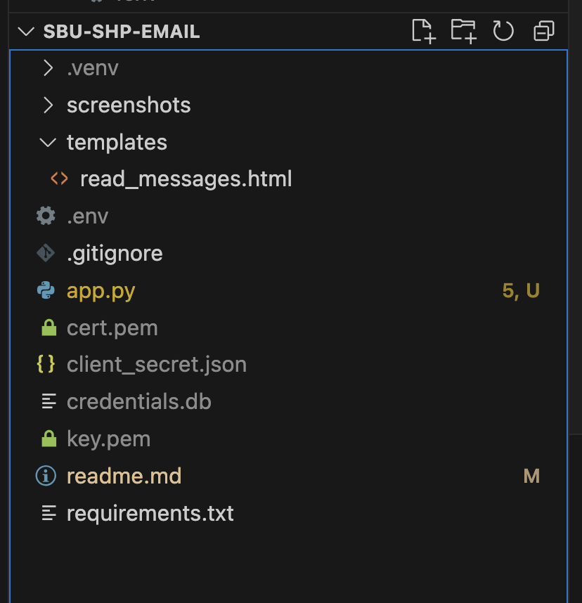

# SBU - SHP Email App: Gmail Python Script Runner

This Flask application allows users to:
1. Authenticate with their Gmail account.
2. Search for email messages by subject line or sender.
3. View basic message details.
4. Execute custom Python code on the retrieved emails and display the output.

The app integrates Google OAuth2.0 for Gmail API access and includes a CodeMirror-based editor for writing and running Python code within the browser. Users can manipulate the retrieved email data and see results in real-time.

## Features

- **Google OAuth 2.0 Authentication**: Secure login via Google allows access to your Gmail messages.
- **Search by Subject or Sender**: Find specific emails using a search query.
- **Python Code Execution**: Write Python scripts in the browser to process and analyze retrieved email data.
- **Code & Output Panel**: A code editor powered by CodeMirror for scripting, and a styled output area with Prism.js for syntax highlighting.

## Technologies Used

- **Flask**: Backend framework for handling API requests.
- **SQLite**: Stores user credentials securely.
- **Google API Client**: Communicates with the Gmail API to retrieve messages.
- **CodeMirror**: In-browser code editor for Python script input.
- **Prism.js**: Syntax highlighting for displaying code output.
- **OAuth2.0**: Ensures secure authentication with Google services.
- **Tailwind CSS**: Styling framework for a clean, responsive layout.

## Getting Started

### Prerequisites

- Python 3.6+
- [Google API Client](https://developers.google.com/identity/protocols/oauth2) for Python
- A Google Cloud Project with Gmail API enabled
- [Client credentials JSON file](https://console.cloud.google.com/) for OAuth 2.0

### Installation

1. **Clone the Repository**
   ```bash
   git clone https://github.com/yourusername/gmail-python-script-runner.git
   cd gmail-python-script-runner
   ```
2. **Set up a Virtual Environment**
    ```bash
    python3 -m venv venv
    source venv/bin/activate  # On Windows use `venv\Scripts\activate`
    ```
3. **Install the Requirements**
    ```bash
    pip install -r requirements.txt
    ```
4. **Set Up Google API Credentials**
    - Create a new project in the [Google Cloud Console](https://console.cloud.google.com/).
    - Enable the Gmail API for the project.
    - Create OAuth 2.0 credentials and download the JSON file.
    - Rename the JSON file to `client_secret.json` and place it in the `gmail-python-script-runner` directory.

5. **Configure Environment Variables**
    - Create a new file named `.env` in the project root.
    - Add the following environment variables to the file:
        ```bash
        ENVIRONMENT=development
        ```
6. **Create local SSL certificate**
- Run the following command to generate a self-signed SSL certificate:
    ```bash
    openssl req -x509 -newkey rsa:2048 -keyout key.pem -out cert.pem -days 365 -nodes
    ```
- When running in development environment, this will allow you to run the app in HTTPS mode.
- So before you run, the folder structure should look like the below screenshot:
    
- The `key.pem` and `cert.pem` files should be in the root directory of the project.
- The `client_secret.json` file should also be in the root directory of the project.
- And the `credentials.db` file will be created in the root directory of the project after running the app for the first time.

7. **Run the Application**
    ```bash
    python app.py
    ```

## Usage

1. Authorize Gmail Access
- Visit the app's homepage and click on the Authorize Gmail Access link. You’ll be redirected to Google’s login page. Once authenticated, the app will redirect you back to your inbox view.

2. Search Emails
- Use the search form to filter messages by Subject or Sender. After searching, you’ll see a list of matching emails with message snippets and basic details.

3. View Email Content
- Click on an email snippet to load and view the full message content on the right panel.

4. Execute Python Code
- In the Execute Python Code panel, use the CodeMirror editor to write a Python script. The retrieved emails are stored in a dictionary called messages, and you can iterate over them, manipulate the data, and assign the results to the output variable.
- For example:
    ```python
    output = []
    for i in messages:
        output.append(i['id'])
    ```
- Click Run Code to execute the script. The output will be displayed in the Code Output section below the editor.

## Example Workflow
1. Login: Authorize the app to access your Gmail.
2. Search for Emails: Use a search query to find specific emails by subject or sender.
3. View Message Details: Browse and select a message to view its full content.
4. Run Python Code: Write custom Python code to interact with the `messages` dictionary and process the data as desired. The output will appear in the designated output section.
